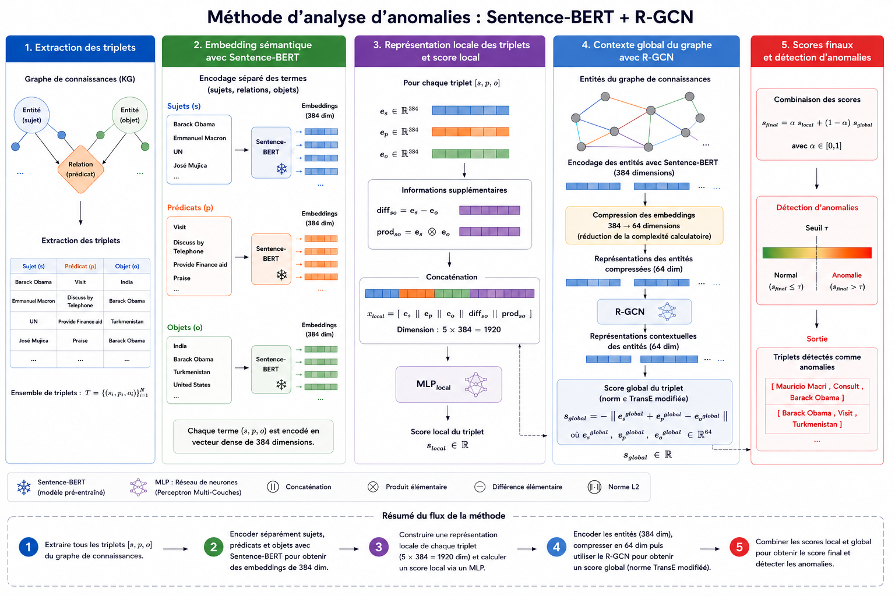

# BERT-RGCN Knowledge Graph Anomaly Detection

Research code for detecting anomalous events in temporal knowledge graphs. The
current model combines a semantic score computed from Sentence-BERT embeddings
with a global R-GCN/TransE score.




**TODO: translate the figure into English**

**TODO: add references to the RGCN paper and the ICEWS18 dataset.**


## Installation

Python 3.10 or newer is required. From the repository root:

```bash
python -m venv .venv
source .venv/bin/activate
python -m pip install -e .
```

For development and tests, install `-e '.[dev]'` instead.

## Data

The training command expects an ICEWS18 directory containing:

- `entity2id.txt`: tab-separated entity label and integer ID;
- `relation2id.txt`: tab-separated relation label and integer ID;
- `train.txt`, `valid.txt`, and `test.txt`: subject ID, relation ID, object ID,
  timestamp, and an optional fifth column.

The ICEWS18 files currently available under `data/icews18/` follow this layout.
Other serialized graph snapshots are stored separately under `data/snapshots/`.
See `data/README.md` for details. Data licensing and the definitive distribution
location (Git or Hugging Face) must be confirmed before the repository is published.

### Validate and describe the dataset

The description command validates identifiers in every official split and creates
human-readable CSV files, relation frequencies, summary statistics, and a degree
distribution figure:

```bash
bert-rgcn-describe-data \
  --data-dir data/icews18 \
  --output-dir data/processed/icews18
```

The generated directory is ignored by Git because every artifact can be recreated
from the raw files. Sentence embeddings are generated by the training pipeline,
where the model name and compute device are recorded with each experiment.

## Run an experiment

```bash
bert-rgcn-train \
  --data-dir data/icews18 \
  --output-dir outputs/bert_rgcn \
  --max-snapshots 10 \
  --epochs 150 \
  --seed 42
```

By default, negative examples are generated deterministically by corrupting one
component of sampled positive triples. Each snapshot produces a model checkpoint,
scores, learning and ROC curves, while `summary.csv` gathers the main metrics.
The exact configuration and resolved compute device are recorded in `config.json`.

### GenAI negative sampling with OpenRouter

Random corruption is the default and does not use an external service. To generate
semantically implausible geopolitical triples with OpenRouter, copy the environment
template and add your key:

```bash
cp .env.example .env
```

```dotenv
OPENROUTER_API_KEY=your-key
```

Then run:

```bash
bert-rgcn-train \
  --data-dir data/icews18 \
  --negative-sampling genai
```

The default OpenRouter model is `openai/gpt-4.1`. It can be changed with
`--openrouter-model`; use `--env-file` if the environment file is not `.env` in
the repository root. GenAI mode makes one paid API request per snapshot. 
Generated labels absent from ICEWS18 are encoded with
the same Sentence-Transformer and added to the vocabulary. API outputs may vary
even when `--seed` is fixed.


### Training workflow

`bert-rgcn-train` runs the complete experiment pipeline. It does not require running
`bert-rgcn-describe-data` first. The current implementation reads `train.txt`; the
official `valid.txt` and `test.txt` splits are not yet used by training.

The following operations are performed once at startup:

1. Load `entity2id.txt`, `relation2id.txt`, and `train.txt`.
2. Select the compute device and initialize all random-number generators from
   `--seed`.
3. Load the configured Sentence-Transformer model.
4. Encode every entity and relation label into a semantic embedding.
5. Group the training events by timestamp and select the snapshots requested by
   `--max-snapshots`.

Then, independently for every selected snapshot, the command:

1. extracts its positive triples;
2. generates `--anomaly-count` negative triples using the strategy selected by
   `--negative-sampling`;
3. rejects generated negatives that are also positives in the current snapshot;
4. splits positives and negatives into disjoint training, validation, and test
   subsets;
5. builds the R-GCN graph using only positive training triples;
6. trains a new BERT + R-GCN model, using validation loss for early stopping;
7. selects an anomaly threshold from the test ROC curve and computes the test AUC;
8. exports the checkpoint, individual scores, loss curve, and ROC curve.

Consequently, processing ten snapshots currently trains ten independent models;
the model is not carried forward from one timestamp to the next.

The generated files have the following layout:

```text
outputs/bert_rgcn/
├── config.json
├── summary.csv
├── snapshot_0000/
│   ├── model.pt
│   ├── scores.csv
│   ├── loss.png
│   └── roc_test.png
└── snapshot_0001/
    └── ...
```

In `scores.csv`, every triple is associated with its local semantic score, global
graph score, combined score, data split, and predicted anomaly label.

During execution, the terminal reports dataset and device information, snapshot
progress, training and validation losses every ten epochs, early stopping, test
AUC, output paths, and total elapsed time.

## Reproducibility note

Each snapshot is split into disjoint training, validation, and test subsets. The
graph is built from training positives only, early stopping uses validation loss,
and the reported AUC is computed on the test subset. The current classification
threshold is nevertheless selected from the test ROC curve; it must be selected
from validation data instead before reporting classification results. The
anomaly-generation protocol and repeated-seed evaluation should also be fixed in
an experiment specification.


## License

The source code is distributed under the terms in [LICENSE](LICENSE). Dataset and
pretrained-model licenses apply independently.
